Last updated: 2026-07-23

This is the original version of the guidance.\
Please find the shared and edited version in X

# A guide for integrating a GitHub repository in Zenodo 
 
## Part 1. Quick start  
**What this quick start covers**
This section is for researchers who want the shortest path to making a GitHub-hosted software project citable in Zenodo. After enabling the repository in Zenodo, each new GitHub release is captured as a snapshot of the repository and archived in Zenodo. 
 
Follow these steps to get a DOI from Zenodo for your GitHub repository:

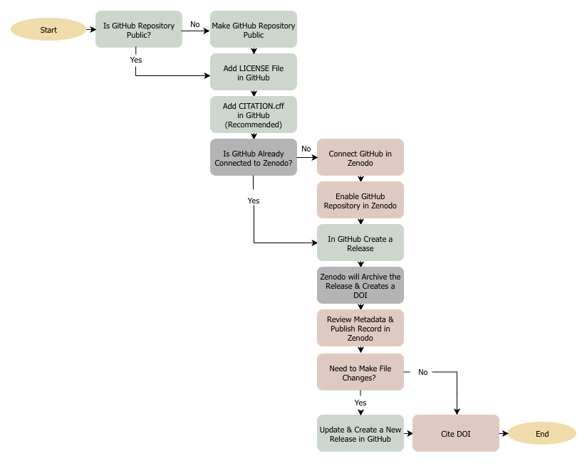
___ 
 
## Part 2. Detailed Guide and Reference 
This section expands on Part 1 (Quick Start) by providing step-by-step instructions for integrating GitHub with Zenodo, with added details and screenshots to guide through each step of the process. 
 
**Table of Contents**
Step 1: In GitHub, make sure your GitHub repository is public 
Step 2: In GitHub, prepare metadata by adding a license file, add a CITATION.cff file 
Step 3: In Zenodo, check that your GitHub repository is connected and enabled in Zenodo 
Step 4: In GitHub, create a new release with a version tag 
Step 5. In Zenodo, confirm that the record was created 
Step 6: Cite the correct DOI 
 
**Step 1. Make sure the repository is public**
Zenodo can only access public GitHub repositories. If the repository is private, Zenodo will not be able to archive it through this method. Files can still be uploaded manually to your Zenodo record as a separate process. 

If the repository was created as public, you can skip to Step 2. If it was created as private, you can change it to public in the repository settings:  

- Go to your repository on GitHub and click Settings 
- This will take you to the General Settings page 
 
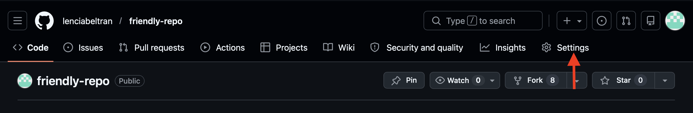

- Scroll down to the “Danger Zone” section 
- Locate “Change your repository visibility” and click “Change visibility” 

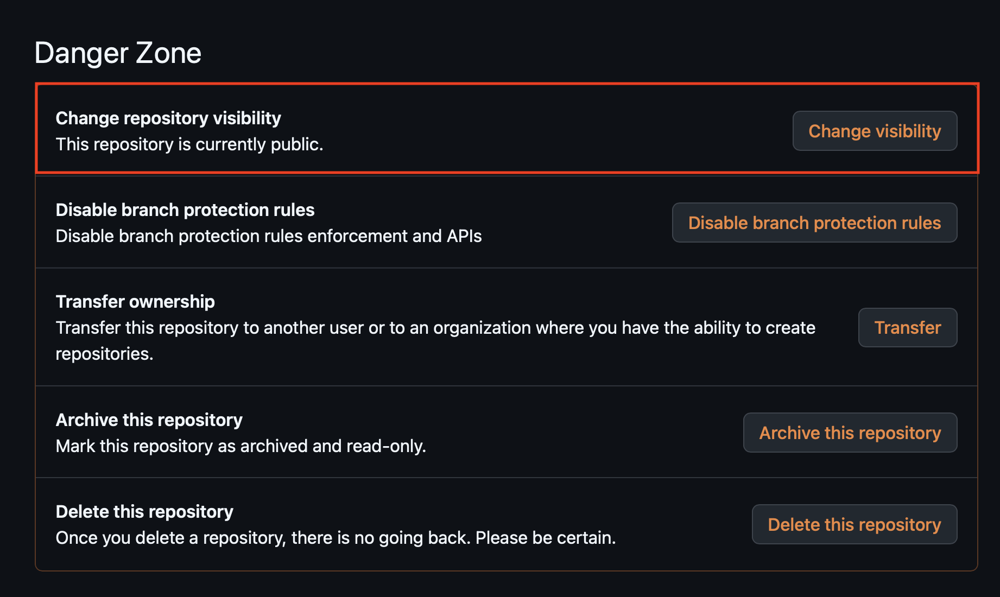

You will be asked to confirm the change (for example, by acknowledging a warning or entering the repository name) before the update is applied. 

**Important:** Making a repository public means that anyone on the internet can view its contents, including files and revision history. Review your repository to ensure it does not contain sensitive or confidential information before proceeding. 
 
___
 
**Step 2. Prepare metadata by adding a license and citation information**
Add a [license file](https://opensource.org/licenses) to the GitHub repository (if one does not already exist) so users know how the software can be reused. It’s also recommended to add a license statement in your README file.  

When creating a repository, GitHub allows you to select a license. If you chose one at the time, a LICENSE file will already appear in your repository (and be visible in the “About” section).  

If your repository does not yet have a license: 
- Go to the repository main page 
- Click “Add file”, then “Create new file” 
 
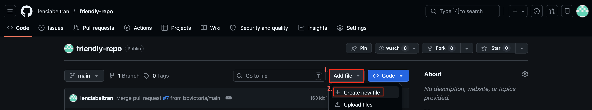\

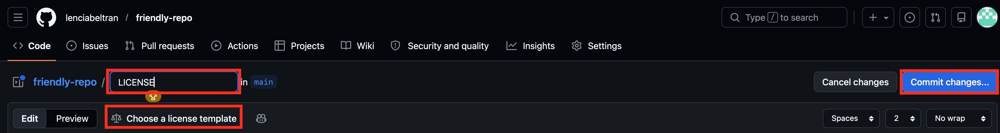

- Name the file LICENSE (upper caps not required) 
- Click “Choose a license template” 
- Select a license and click “Review and submit” 
- Commit the file with a descriptive message 

A commonly used license is the [MIT License](https://opensource.org/license/mit), but [choose a license](https://opensource.org/licenses) that makes sense for your project. 

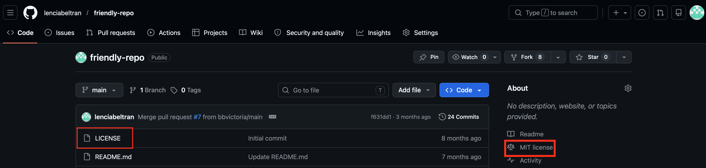

**Add a CITATION.cff file (Recommended)**
Consider adding a [CITATION.cff](https://docs.github.com/en/repositories/managing-your-repositorys-settings-and-features/customizing-your-repository/about-citation-files) file so GitHub can display a “Cite this repository” link.  

The file provides structured citation metadata:  
- GitHub uses the CITATION.cff file to create a citation for your repository 
- Zenodo *may* use GitHub metadata to pre-fill necessary metadata when archiving  

**Note:** If both a CITATION.cff file and a .zenodo.json file are present, [Zenodo will prioritize .zenodo.json](https://help.zenodo.org/docs/github/describe-software/citation-file/) and ignore the CITATION.cff for metadata extraction. 

To add a CITATION.cff file:  
- Click “Add file”, then “Create new file” 
- Name the file CITATION.cff 
- Use the “Insert example” at the top right side 
- Edit the template with the details from your project 
- Commit changes and write a descriptive commit message 
 
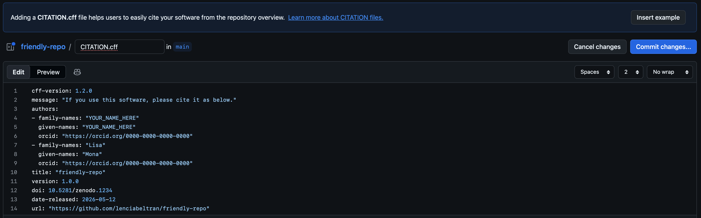

Adding a [CITATION.cff](https://citation-file-format.github.io) ensures your software is citable directly from GitHub, even before creating a Zenodo release. Create your CITATION.cff file using the [CFFINIT generator tool](https://citation-file-format.github.io/cff-initializer-javascript/#/). 

___

**Step 3. Connect GitHub to Zenodo and enable the repository**
**Important:** If you created a GitHub release before enabling the repository in Zenodo, Zenodo will not go back and archive that earlier release automatically. You will need to create a new release after the integration is enabled.  

1. Log in to Zenodo. 
2. Click your profile name in the top-right corner and select GitHub from the dropdown menu. 

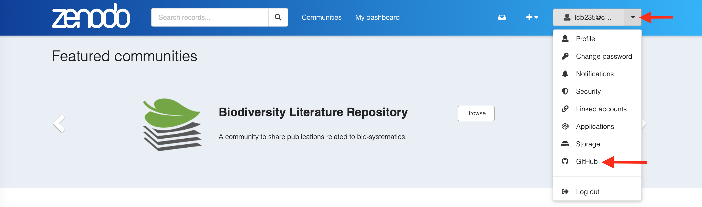

If this is your first time connecting GitHub to Zenodo: 
- Click “Connect”

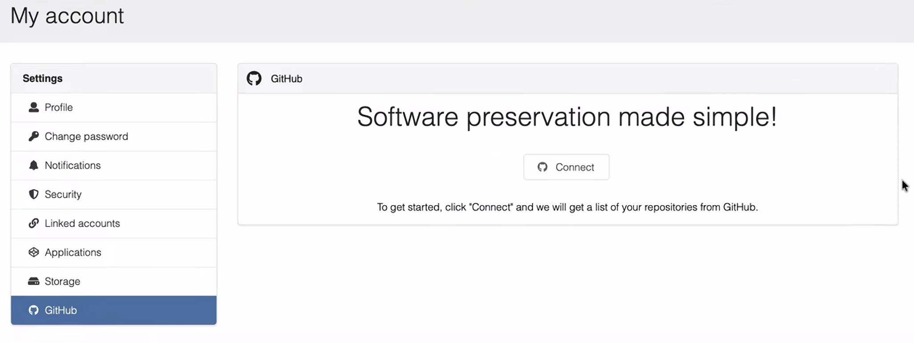
 
- You will be redirected to GitHub to sign in 
- You may be asked to enter a verification code, depending on your account security settings 
- Click “Authorize Zenodo” to grant access 

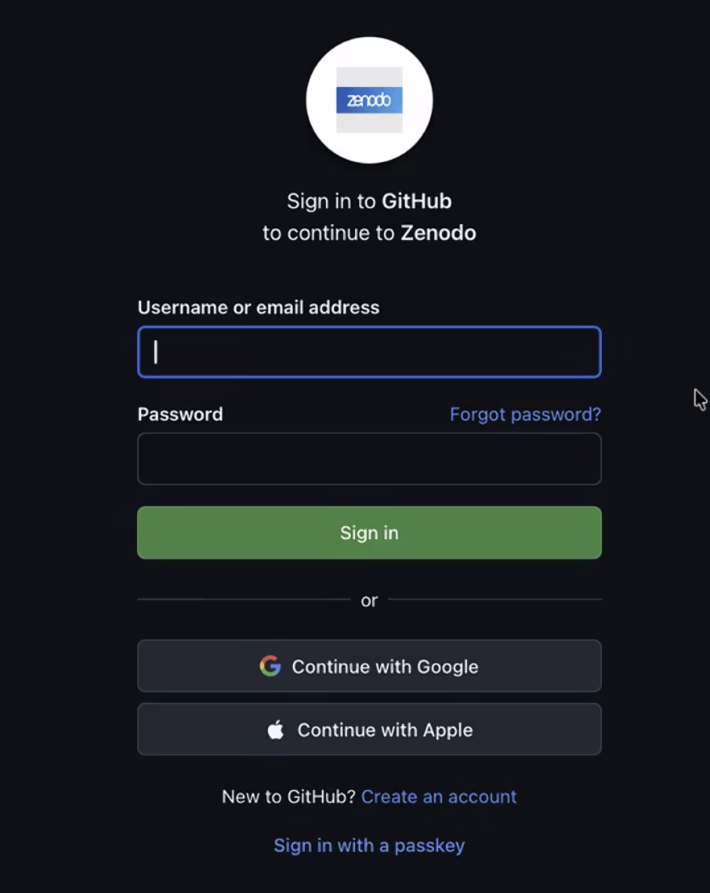

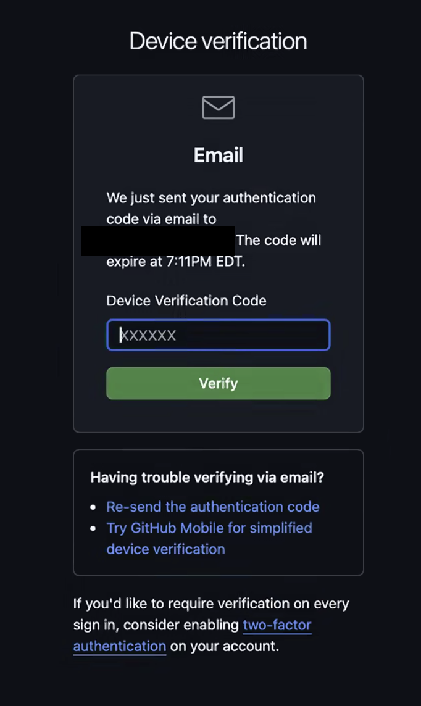

After authorization, return to Zenodo.  
1. In Zenodo, navigate to the GitHub section of your account settings. 
2. You will see a list of your GitHub repositories. 
3. Find the repository you want to archive and toggle the switch next to it to enable it. 
4. After enabling, reload your browser page in order to see the enabled repository.

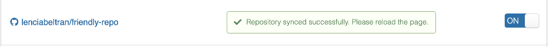
 
Enabling the repository gives Zenodo permission to monitor and automatically archive new releases, which will generate a DOI. 

You are not quite done yet! 
___

**Step 4. Create a GitHub release**
Enabling the GitHub repository in Zenodo is one step in a two-step process. Once the repository is enabled in Zenodo, the next step is to return to GitHub and create a release. 

These steps must be completed in this order since Zenodo only archives releases that are created after the repository has been enabled. 

If your repository already has existing releases, you will need to create a new release for Zenodo to archive it and generate a DOI. Zenodo does not retroactively archive earlier releases. 
In GitHub: 
- Go to your repository 
- On the right-hand side under Releases, click “Create a new release”  

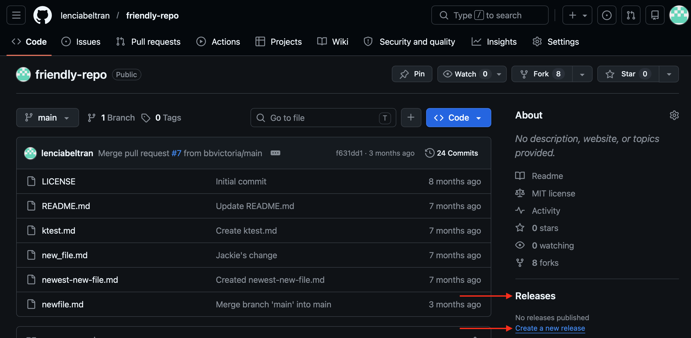

In the release form: 
- Choose an existing tag or create a new one  
  - Use a clear version tag such as v1.0.0, v1.1.0, or v1.1.1. Visit [Semantic Versioning](https://semver.org/) for more details.  
  - Note, GitHub automatically assigns the ‘latest release’ label based on versioning. Typically, pre-releases are not marked as the latest release, unless you manually set as latest release 
- Give the release a title 
- Add release notes (describe the project release). 
  - Write release notes manually, summarizing the project, changes, and contributors 
  - Or click “Generate release notes” 
    - Automatically generated notes include: 
      - Merged pull requests since the previous release 
      - A list of contributors 
      - A link to the changelog 
 
[Fill in the release in GitHub](screenshots/github_addrelease.png "Fill in the release in GitHub")

- You can save the release as a draft or click “Publish release” when ready 
  - GitHub also lets you mark the release as a pre-release if it is not yet considered stable 
___ 
 
**Step 5. Confirm a Zenodo record was created**
After you publish a release in GitHub, Zenodo will automatically process it and archive a snapshot of the repository. 

This process may take some time, depending on the size of the repository and system load. Try refreshing every few minutes if you don’t see a Zenodo record of your GitHub reposiory. 

Once processing is complete: 
- Go to your Zenodo Dashboard 
- Navigate to “My uploads” 
- Locate the new record and click “View” 

[Dashboard and Uploads page in Zenodo](screenshots/zenodo_dashboard.png "Dashboard and Uploads page in Zenodo")

On the record page: 
- Click “Edit” on the right-hand side to review and update the metadata 

[Edit metadata in zenodo record](screenshots/zenodo_editrecord.png "Edit metadata in zenodo record")

You will see fields under “Basic Information,” including: 
- DOI
- Title 
- Authors 
- Description 
- License 

You can update this information as needed. For example, you might want to adjust the title to clarify the relationship to a publication (e.g., “Data and Code from: …”), depending on your project. 

When you are done editing the metadata, click “Publish.” If you need to change GitHub files, you must make those edits in GitHub (or locally on your machine and push them to GitHub), then create a new release to update your Zenodo record. 
___ 

**Step 6. Cite the correct DOI**
Each time a new release is created in GitHub and Zenodo archives it, a new version-specific DOI is generated. 
 
A Zenodo record will include: 
- A version-specific DOI (for that exact release) 
- A concept DOI that represents all versions of the software 

Both DOIs can be found in the “Versions” section on the right-hand side of the Zenodo record page, which lists all of the versions and provides links to their associated DOIs. Zenodo has an example of what a [version-specific and concept DOI](https://support.zenodo.org/help/en-gb/1-upload-deposit/97-what-is-doi-versioning).

For citation purposes: 
Use the version-specific DOI when citing a specific release so that users know which version to refer to. 

Use the concept DOI when citing the software project as a whole across multiple versions. Check out [Zenodo’s DOI versioning documentation](https://zenodo.org/help/versioning) for more details. 
___

**In case it’s helpful:**
Once a Zenodo record for your GitHub repository has been created, you have 30 days to delete the record. 
 
If you experience any issues integrating your GitHub repository with Zenodo, please [open a support ticket with Zenodo](https://about.zenodo.org/contact/). Their support team can help troubleshoot the issue because the integration is tied directly to your account. 
 
If you have any questions about the GitHub–Zenodo integration, feel free to reach out—we're happy to help. 
open-scholarship@cornell.edu or data-help@cornell.edu 
 
**Resources:**
- [Zenodo documentation](https://help.zenodo.org/docs/github/)
- [GitHub documentation](https://docs.github.com/en/repositories/archiving-a-github-repository/referencing-and-citing-content) 
- [Citation file format](https://citation-file-format.github.io)
- [The Turing Way, Software Citation with CITATION.cff](https://book.the-turing-way.org/communication/citable/citable-cff/)
- [Open Source Initiative (OSI) approved licenses](https://opensource.org/licenses)
___

**Acknowledgements:**
Special thanks to my colleagues, Gabby Evergreen, Dianne Dietrich, Wendy Kozlowski, Jennifer McKee, and Sarah Wright for reviewing this guide. 
 
If you use this guide, please kindly cite:  